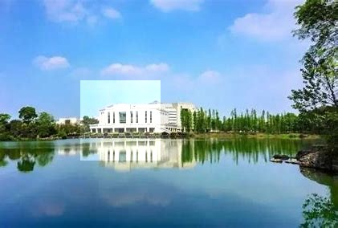
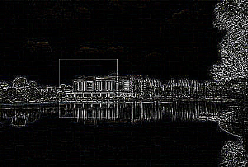

相比于传统图像存储，dySim使用`Tensor`存储，注意，必须是二维`Tensor`，否则接受这个`Tensor`的图像处理函数会返回一个错误。

> 存储结构上，`Tensor`的访问$(x,y)$和传统图像存储的一致，但由于可以使用索引访问，因此访问便捷性更高。

## imread/imwrite 图像读写

这个案例读取了一张图片，然后把它写入另一个文件夹中。`ret`是函数`imwrite`的写入结果，类型是`bool`。

~~~cpp
#include <dyPicture.hpp>

int main() {
  dym::TimeLog T;
  auto pic = dym::imread<int, dym::PIC_RGB>("./image/uestc.jpg");

  auto ret = dym::imwrite(pic, "./image_out/newPic.jpg");
  qprint(dym::pi(pic.shape()), ret);

  return 0;
}
~~~

## 像素访问

这个操作使图像中一个矩形区域的亮度提高50。

~~~cpp
#include <dyPicture.hpp>

int main() {
  dym::TimeLog T;
  auto pic = dym::imread<int, dym::PIC_RGB>("./image/uestc.jpg");

  // -----new-----
  for (int i = 100; i < 200; ++i)
    for (int j = 100; j < 200; ++j) pic[dym::gi(i, j)] += 50;
  // -------------

  auto ret = dym::imwrite(pic, "./image_out/newPic.jpg");
  qprint(dym::pi(pic.shape()), ret);
  return 0;
}
~~~

它的结果如下所示：

## 写一个滤波试试

对上面那个图片做个拉普拉斯滤波提取一下边缘！

~~~cpp
#include <dyPicture.hpp>

int main() {
  dym::TimeLog T;
  auto pic = dym::imread<int, dym::PIC_RGB>("./image/uestc.jpg");

  for (int i = 100; i < 200; ++i)
    for (int j = 100; j < 200; ++j) pic[dym::gi(i, j)] += 50;

  // -----new-----
  dym::Matrix<int, 3, 3> kernel_L(-1);
  kernel_L[1][1] = 8;
  qprint(kernel_L);

  pic = dym::filter2D(pic, kernel_L, dym::BORDER_REPLICATE);
  // -------------

  auto ret = dym::imwrite(pic, "./image_out/newPic.jpg");
  qprint(dym::pi(pic.shape()), ret);
  return 0;
}
~~~

它的结果如下所示：

你可能会觉得，不对啊？和教科书上的结果有点出入。确实有出入，因为我忽略了一步（找找？），但这只是个示范哦！

## 画一些点

摆烂一下，不如画点点吧！

~~~cpp
#include <dyPicture.hpp>

int main() {
  dym::TimeLog T;
  auto pic = dym::imread<int, dym::PIC_RGB>("./image/uestc.jpg");

  ...

  auto r = dym::clear(pic, dym::Vector<int, 3UL>({0, 150, 150}));

  dym::Tensor<dym::Vector<Real, 2>> loc(
      {dym::Vector<Real, 2>({0.1, 0.2}), dym::Vector<Real, 2>({0.3, 0.4}),
       dym::Vector<Real, 2>({0.5, 0.6}), dym::Vector<Real, 2>({0.7, 0.8})},
      true);
  loc.show();

  auto ans = dym::scatter(pic, loc, dym::Vector<int, 3>({200, 50, 50}), 1);
  qprint(ans, dym::pi(pic_l.shape()));
  dym::imwrite(pic, "./image_out/newPic2.jpg");
  return 0;
}
~~~

`ans`是一共画了多少点，方便你判断是否绘制成功。`loc`是坐标，数值范围为$[0,1]$。第三个参数是点颜色，第四个参数是点半径。

它的结果如下所示：

